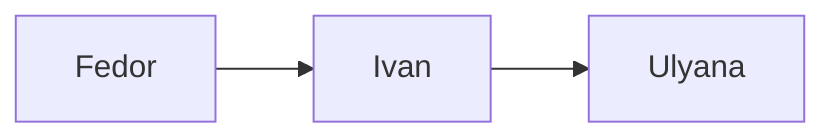
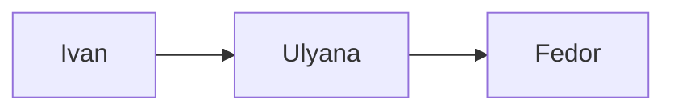

Лабораторна робота №1

**Тема роботи:** Симетричне, асиметричне і гібридне шифрування інформації
* * *
## Структура роботи
Для написання лабораторної роботи використовувалась мова програмування **Javascript**.
Середовище виконання **Node.js v14.15.5**
Проект має наступну структуру директорій та файлів:
- index.js
- utils.js
- /classes
	- Client.js
	- DataPackage.js
	- SymmetricFileCypher.js
- /foldres
	- fedor
		- lab1.docx
	- ivan
		- lab1.docx
	- ulyana
		- lab1.docx
* * *
## Схема роботи програми
Усього пересилаються два повідомлення:
- Від Федора до Ульяни через Івана
`fedor.send(fedorsDataPackage).to(ivan).to(ulyana);`

- Від Івана до Федора через Ульяну
`ivan.send(ivansDataPackage).to(ulyana).to(fedor);`


## Демонстрація роботи
```
ilienkors@curiosity:~/Projects/security/lab1$ node index.js 
------------------------------
Sended from Fedor to Ulyana through Ivan
Ivan see: { from: 'Fedor', to: 'Ulyana', message: 'ด㸶㠖㠖昀尽敾㠖㤦姍崆姍尽媠䦡昀ೱ尽伆㸶〒昀䦡卤' }
Ulyana see: { from: 'Fedor', to: 'Ulyana', message: 'Hello Ulyana from Fedor!' }
------------------------------
Sended from Ivan to Fedor through Ulyana
Ulyana see: {
  from: 'Ivan',
  to: 'Fedor',
  message: 'ۆॠሶሶၞ\x85ണॠਥၞࢭ\x85րࢭၞԢ\x85ൄརŪʐ'
}
Fedor see: { from: 'Ivan', to: 'Fedor', message: 'Hello Fedor from Ivan' }
```

## Опис основних частин програми
Спочатку створюються необхідні клієнти системи:
`constructor(name, path, password = "")`
```
const fedor = new Client("Fedor", "./folders/fedor");
const ivan = new Client("Ivan", "./folders/ivan");
const ulyana = new Client("Ulyana", "./folders/ulyana");
```

Після чого додаємо їх один одному:
`addClients(...clients)`
```
fedor.addClients(ivan, ulyana);
ivan.addClients(fedor, ulyana);
ulyana.addClients(fedor, ivan);
```

Створюємо пакет для відправки:
`constructor(from, to, message, filePath = null, password = "")`
```
const fedorsDataPackage = new DataPackage(
  fedor,
  ulyana,
  "Hello Ulyana from Fedor!",
  fedor.path + "/lab1.docx",
  fedor.password
);
```

Надсилаємо пакет по ланцюгу:
```
fedor.send(fedorsDataPackage).to(ivan).to(ulyana);
```

Та виводимо результат кожного участника передачі:
| Учасник  | Повідомлення |
| ------------- | ------------- |
| Ivan  | { from: 'Fedor', to: 'Ulyana', message: 'ᶧժᅎᅎ΋ ଼ᅎଝவરவ ઀ᜈ΋ᡈ ⅾժᘩ΋ᜈஂ' }  |
| Ulyana  | { from: 'Fedor', to: 'Ulyana', message: 'Hello Ulyana from Fedor!' }  |

Сберігаємо файл:
```
ulyana.saveNewFile();
ivan.saveNewFile();
```
Результат:
```
ilienkors@curiosity:~/Projects/security/lab1$ tree folders/
folders/
├── fedor
│   └── lab1.docx
├── ivan
│   ├── lab1.docx
│   └── saved.docx
└── ulyana
    ├── lab1.docx
    └── saved.docx

3 directories, 5 files
```

## Детальний опис окремих складових
**Шифрування повідомлення** відбувалося за допомогою розбиття його на окремі символи, форматування у utf-16 код та подільшим шифрування кожного символа відкритим ключем rsa.
```
const stringToCharcodesArray = text => {
  return text.split('').map(char => BigInt(char.charCodeAt(0)));
}

const encryptMessage = (message, e, n) => {
  return message.map(charCode => (BigInt(charCode) ** BigInt(e)) % BigInt(n));
}
```
Для дешифровки процес зворотній з використанням приватного ключа.
```
const decryptMessage = (message, d, n) => {
  return message.map(charCode => (BigInt(charCode) ** BigInt(d)) % BigInt(n));
}

getDecryptedMessage() {
    const decryptedMessage = decryptMessage(this.dataPackage.message, this.privateKey.d, this.privateKey.n);
    return {
      from: this.dataPackage.from.name,
      to: this.dataPackage.to.name,
      message: decryptedMessage.map(char => String.fromCharCode(Number(char))).join('')
    };
  }
```
***
**Шифрування файла** відубвалося за допомогою алгоритму **aes-256-ctr**. Він був обраний через свою гарну криптостійкість та наявність готових реалізацій в стандартній бібліотеці Javascript **crypto**
```
class SymmetricFileCypher {
  static algorithm = 'aes-256-ctr';

  static encrypt(buffer, key) {
    key = crypto.createHash('sha256').update(String(key)).digest('base64').substr(0, 32);
    const iv = crypto.randomBytes(16);
    const cipher = crypto.createCipheriv(SymmetricFileCypher.algorithm, key, iv);
    const result = Buffer.concat([iv, cipher.update(buffer), cipher.final()]);
    return result;
  };

  static decrypt(encrypted, key) {
    key = crypto.createHash('sha256').update(String(key)).digest('base64').substr(0, 32);
    const iv = encrypted.slice(0, 16);
    encrypted = encrypted.slice(16);
    const decipher = crypto.createDecipheriv(SymmetricFileCypher.algorithm, key, iv);
    const result = Buffer.concat([decipher.update(encrypted), decipher.final()]);
    return result;
  };
}
```
***
**Метод реалізації алгоритму RSA та супровідні функції**
```
rsaGen() {
    const p = getRandomPrimeNumber();
    const q = getRandomPrimeNumber();
    const n = p * q;
    const fiN = (p - 1) * (q - 1);
    const e = getCoprimeIntegersNumber(fiN);
    const d = getD(e, fiN);

    return {
      openKey: { e, n },
      privateKey: { d, n },
    }
  }
  
const getRandomInt = (minInput, maxInput) => {
  const min = Math.ceil(minInput);
  const max = Math.floor(maxInput);
  return Math.floor(Math.random() * (max - min) + min);
}
  
const getRandomPrimeNumber = () => {
  const number = 2;
  const min = getRandomInt(number, number * 100);
  const max = getRandomInt(number * 100, number * 1000);

  for (let i = min; i < max; i++) {
    let isPrimeNumber = true;
    for (let j = 2; j < max; j++) {
      if (i % j === 0 && j != i) {
        isPrimeNumber = false;
      }
    }
    if (isPrimeNumber)
      return i;
  }
}

const getCoprimeIntegersNumber = (fiN) => {
  while (true) {
    const randomPrimeNumber = getRandomPrimeNumber();
    if (randomPrimeNumber > 1 && randomPrimeNumber < fiN && fiN % randomPrimeNumber !== 0)
      return randomPrimeNumber;
  }
}

const getD = (e, fiN) => {
  for (let d = getRandomInt(10, 1000); d < Infinity; d++) {
    if ((e * d) % fiN === 1)
      return d;
  }
}
```
***
**Класс DataPackage** (*Package неможливо використовувати через зарезервоване слово*)
```
class Package {
  constructor(from, to, message, filePath = null, password = "") {
    this.from = from;
    this.to = to;
    this.message = encryptMessage(stringToCharcodesArray(message), to.openKey.e, to.openKey.n);
    if (filePath) {
      const plain = readFileSync(filePath);
      this.file = SymmetricFileCypher.encrypt(plain, password);
    }
    this.password = encryptMessage(stringToCharcodesArray(password), to.openKey.e, to.openKey.n);
  }
}
```

## Вихідний код
У звіті описано майже весь код, але повну його реалізацію можна знайти за [цим посиланням на github репозиторій](https://github.com/ilienkors/symmetric-asymmetric-hybrid-ciphers)

## Контрольні запитання
1. **В чому полягає принцип симетричного шифрування? Які у такого шифрування є переваги та недоліки.**
Шифрування з симетричними ключами — схема шифрування, у якій ключ шифрування, та ключ дешифрування збігаються, або один легко обчислюється з іншого та навпаки. В основному, симетричні алгоритми шифрування вимагають менше обчислень, ніж асиметричні. На практиці, це означає, що якісні асиметричні алгоритми в сотні або в тисячі разів повільніші за якісні симетричні алгоритми. Недоліком симетричних алгоритмів є необхідність мати секретний ключ з обох боків передачі інформації. Так як ключі є предметом можливого перехоплення, їх необхідно часто змінювати та передавати по безпечних каналах передачі інформації під час розповсюдження. 
2. **В чому полягає принцип асиметричного шифрування? Які у такого шифрування є переваги та недоліки.**
Асиметричні криптосистеми — ефективні системи криптографічного захисту даних, які також називають криптосистемами з відкритим ключем. В таких системах для зашифровування даних використовують один ключ, а для розшифровування — інший (звідси і назва — асиметричні). Перший ключ є відкритим і може бути опублікованим для використання усіма користувачами системи, які шифрують дані. Розшифровування даних за допомогою відкритого ключа неможливе. Для розшифровування даних отримувач зашифрованої інформації використовує другий ключ, який є секретним (закритим).
Основні переваги і недоліки були наведені у відповіді на попереднє питання - він безпечніше за симетричне шифрування, але повільніше.
3. **Перерахуйте декілька відомих вам алгоритмів симетричного і асиметричного шифрування.**
	1. RSA
	2. AES
	3. DES
4. **Опишіть роботу алгоритму Діффі-Геллмана.**
Узгодження спільного таємного ключа відбувається таким чином.
Нехай G — скінченна циклічна група потужністю |G| породжена g.
Аліса і Боб таємно обирають два випадкових цілих числа sA та sB, в інтервалі [0, |G| − 1]. Потім вони таємно обчислють числа aA = gsA та aB = gsB відповідно, та обмінюються ними через незахищений канал передачі даних. Нарешті, Аліса та Боб обчислюють aBA = aBsA = gsBsA та aAB = aAsB = gsAsB відповідно. Слід зазначити, що aAB = aBA, і тому це число може служити спільним таємним ключем K Аліси та Боба.
Точніше, тепер Аліса та Боб можуть скористатись відображенням елементів множини G у простір іншої криптосистеми. Наприклад, вони можуть використати блок даних необхідного розміру (зокрема, молодші біти) значення aAB як ключ звичайної блочної криптосистеми. 
5. **В чому полягає принципова різниця між алгоритмами Діффі-Геллмана і RSA?**
На відміну від Діффі-Хеллмана, алгоритм RSA може використовуватися для підписання цифрових підписів, а також обміну симетричним ключем, але він вимагає попереднього обміну відкритим ключем. 

## Висновок

У ході даної лабораторної роботи було розглянуто симетричне, асиметричне і гібридне шифрування інформації та розроблено програмну реалізацію.